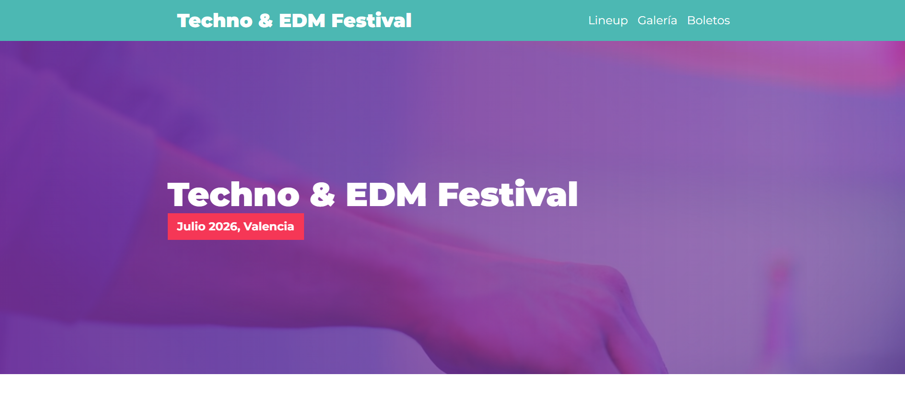

# Festival de Música 🎶
Este proyecto es una página web creada para aprender y practicar SCSS, estructuración de archivos con Gulp y JavaScript, como parte de un curso en Udemy. Aunque el desarrollo partió de un ejercicio guiado, tengo pensando realizar varias personalizaciones para darle un toque más personal.
## Personalizaciones Realizadas ✨

Aunque el proyecto está basado en un curso de Udemy, se han hecho los siguientes cambios para personalizar y mejorar la página web:

- **Imágenes** 🏙️: Se han sustituido las imágenes originales por contenido propio para dar un estilo único y adaptado al tema del festival.
- **Estilos** 🎨: Se han realizado ajustes en los estilos SCSS para mejorar el diseño responsivo y la estética de la página.

## Vista Previa 🌐



## Enlace al Sitio Web

Puedes visitar el sitio web aquí: [https://festival-de-musica-aikarubi.netlify.app/](https://festival-de-musica-aikarubi.netlify.app/)

---

## Características ⭐

- **Diseño responsivo** 📱: Utiliza Grid y Flexbox junto con mixins de SCSS para facilitar la adaptación a diferentes tamaños de pantalla.
- **Galería interactiva** 🖼️: Implementada con JavaScript, la galería permite ampliar imágenes con un clic, usando modales.
- **Efectos modernos** ✨: Uso de animaciones y transiciones CSS para mejorar la experiencia del usuario.
- **Performance Web** 📈: Optimización de archivos multimedia para una carga más rápida del sitio web.

## Tecnologías Utilizadas ⚙️

- HTML5, CSS3, SCSS (preprocesado con SASS)
- JavaScript
- Google Fonts
- Librería Modernizr
- Gulp para automatización de tareas de compilación y minificación

## Instalación y Configuración 🔧
**Requisitos previos**
Asegúrate de tener instalados Node.js y npm en tu sistema para ejecutar las tareas automatizadas y compilar SCSS.

Para ejecutar el proyecto localmente:

1. Clona el repositorio:
   ```bash
   git clone https://github.com/Aikarubi/festival-de-musica.git
   
2. Navega al directorio del proyecto:
   ```bash
   cd festival-de-musica
   ```

3. Instala las dependencias del proyecto:
   ```bash
   npm install
   ```

4. Ejecuta el siguiente comando para iniciar el servidor de desarrollo y compilar SCSS automáticamente:
   ```bash
   npm run dev
   ```

5. Abre `index.html` en tu navegador o accede al servidor de desarrollo en `http://localhost:3000`.

<br>

## Edición del Proyecto ✒️

### ⚠️Si deseas modificar los estilos o el código JavaScript, ten en cuenta que **los archivos CSS no deben editarse directamente**, ya que son generados automáticamente a partir de los archivos SCSS. Cualquier cambio manual en los CSS será sobrescrito al compilar.⚠️ 

Para visualizar los cambios que hagas en los archivos SCSS:

1. Realiza los cambios directamente en los archivos SCSS ubicados en `src/scss`.
  
2. Para que los cambios sean aplicados, abre la terminal y ejecuta:
   ```bash
   npm run dev
   ```

3. Gulp se encargará de compilar los archivos SCSS y actualizar los CSS de forma automática.

---

¡Gracias por revisar el proyecto, cualquier duda o sugerencia no dudes en ponerte en contacto conmigo a través de LinkedIn o la zona de contacto de mi portfolio, todo enlazado en mi perfil!✌🏻
   
